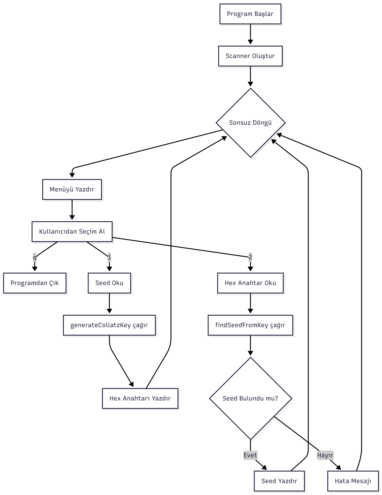

# 🔐 Collatz Conjecture Based Key Generation System

Bu proje, **Collatz Sanısı (3n + 1)** matematiksel modelini kullanarak **deterministik ancak yüksek karmaşıklığa sahip 64-bit kriptografik anahtarlar** üretmek amacıyla geliştirilmiştir. 🚀  

Algoritma, rastgelelik ihtiyacını Collatz döngüsünün **kaotik doğasından** alır.

---

## 📌 Proje Hakkında

Standart Collatz döngüsünde bulunan:

- Sonsuz döngüye girme  
- Tahmin edilebilirlik  

gibi problemleri aşmak için sisteme **iki temel güvenlik katmanı** eklenmiştir:

### 🔄 1. Dinamik Yeniden Tohumlama (Dynamic Re-seeding)
Sayı **1** değerine ulaştığında algoritma durmaz.  
Bunun yerine:
- Başlangıç tohumu (**seed**) 1 artırılır
- Döngü yeni bir yapı ile devam eder

### ✂️ 2. Bit Kırpma (Truncation)
- Hedef uzunluk: **64 bit**
- Üretilen toplam bit: **68 bit**
- Son **4 bit** sistemden atılır  

Bu yöntem, algoritmanın izlerini gizleyerek **tersine mühendisliği zorlaştırır**.

---

## 📊 Algoritma Akış Şeması

Aşağıdaki diyagram, sistemin bir başlangıç sayısından (**seed**) başlayarak nasıl **güvenli bir Hex anahtara** dönüştüğünü özetler.

> ⚠️ **Not:** `flowchart.png` dosyasını proje dizinine eklemeyi unutmayın.

---

## 🛠 Çalışma Mantığı

Algoritma aşağıdaki adımları izler:

### 1️⃣ Giriş
- Kullanıcıdan `long` tipinde bir başlangıç değeri (**Seed**) alınır.

### 2️⃣ Üretim (Generation)

- Sayı **çift** ise  
